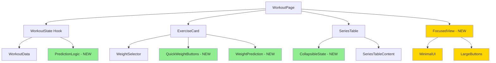
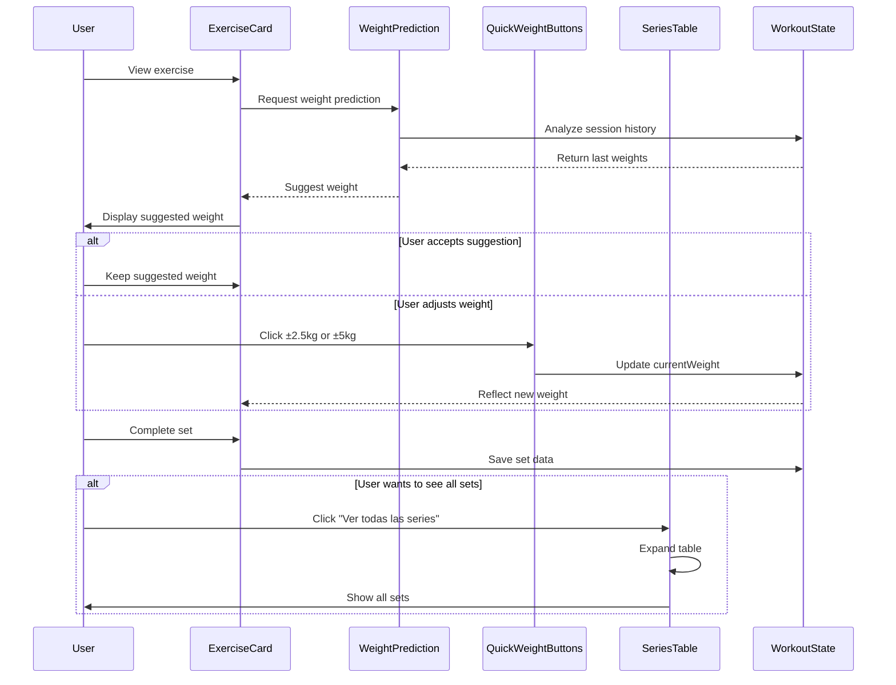

# Design Document: Fase 2 Core Optimizations

## Overview

This design document outlines the technical implementation for Fase 2 Core Optimizations of the workout experience. Building upon the Fase 1 Quick Wins (optional execution modal, "Repeat Previous" button, visual feedback improvements, and minimizable timer), this phase focuses on four key optimizations that will significantly reduce user friction during workouts: collapsible SeriesTable by default, quick weight adjustment buttons (±2.5kg, ±5kg), intelligent weight prediction based on workout history, and an optional focused mode for distraction-free training.

The primary goals are to reduce clicks by 50%, decrease time per set by 33%, and minimize required scrolling by 60%. These improvements target the most common pain points identified in user feedback: excessive scrolling on mobile devices, repetitive manual weight adjustments, and cognitive overhead from displaying too much information simultaneously.

## Architecture

The Fase 2 optimizations integrate seamlessly with the existing workout page architecture, enhancing the ExerciseCard, SeriesTable, and workout state management without requiring major structural changes.



Legend:
- Green boxes: High priority features (Collapsible SeriesTable, Quick Weight Buttons, Weight Prediction)
- Yellow boxes: Low priority feature (Focused Mode - optional)
- Existing components remain unchanged

## Main Algorithm/Workflow



## Components and Interfaces

### Component 1: CollapsibleSeriesTable

**Purpose**: Reduce vertical space consumption by collapsing the SeriesTable by default, showing only essential information.

**Interface**:
```typescript
interface CollapsibleSeriesTableProps extends SeriesTableProps {
  isExpanded: boolean;
  onToggleExpanded: () => void;
  showCompactSummary?: boolean;
}
```

**Responsibilities**:
- Render collapsed state showing only current set info
- Provide toggle button to expand/collapse
- Maintain expansion state during workout
- Show compact summary when collapsed (e.g., "3 of 10 series completadas")

**State Management**:
```typescript
// In WorkoutPage
const [isSeriesTableExpanded, setIsSeriesTableExpanded] = useState(false);
```

### Component 2: QuickWeightButtons

**Purpose**: Provide one-click weight adjustments without opening the WeightSelector dropdown.

**Interface**:
```typescript
interface QuickWeightButtonsProps {
  currentWeight: number | '';
  onWeightChange: (newWeight: number) => void;
  increments?: number[]; // Default: [-5, -2.5, 2.5, 5]
  showFeedback?: boolean; // Show toast on adjustment
}
```

**Responsibilities**:
- Render adjustment buttons with clear labels
- Handle weight adjustments with validation (no negative weights)
- Provide visual feedback on click
- Optional toast notification for adjustments

**Implementation Location**: Inside ExerciseCard, below reps/weight inputs, above "Repeat Previous" button


### Component 3: WeightPredictionEngine

**Purpose**: Intelligently predict weights based on workout history and current context.

**Interface**:
```typescript
interface WeightPredictionParams {
  exerciseName: string;
  currentSet: number;
  sessions: Session[];
  currentExercise: Exercise;
  actualWeights: Record<string, number[]>;
  exerciseId: string;
}

interface WeightPredictionResult {
  predictedWeight: number;
  confidence: 'high' | 'medium' | 'low';
  source: 'last_session' | 'previous_set' | 'routine_default' | 'progression';
  reasoning: string;
}

function predictWeight(params: WeightPredictionParams): WeightPredictionResult;
```

**Responsibilities**:
- Analyze session history for the exercise
- Consider fatigue accumulation (set number)
- Detect progression patterns
- Provide confidence level and reasoning
- Return fallback to routine default if no history

**Prediction Logic Priority**:
1. **Set 1**: Use last session's first set weight (if available)
2. **Set 2+**: Use previous set weight from current workout (if available)
3. **Progression Detection**: If last session completed all reps, suggest +2.5kg or +5kg
4. **Fallback**: Use routine's configured weight

### Component 4: FocusedView (Optional - Low Priority)

**Purpose**: Provide a distraction-free, full-screen view showing only the current set.

**Interface**:
```typescript
interface FocusedViewProps {
  exercise: Exercise;
  currentSet: number;
  currentReps: number | '';
  currentWeight: number | '';
  onRepsChange: (reps: number | '') => void;
  onWeightChange: (weight: number) => void;
  onComplete: () => void;
  onExit: () => void;
  setStartTime: number | null;
}
```

**Responsibilities**:
- Render full-screen overlay with dark background
- Display only essential information (exercise name, set number, timer)
- Provide large touch targets (60x60px minimum)
- Show exit button prominently
- Maintain workout state while in focused mode


## Data Models

### Model 1: CollapsibleState

```typescript
interface CollapsibleState {
  isExpanded: boolean;
  lastToggleTime: number;
  userPreference?: 'always_expanded' | 'always_collapsed' | 'remember_last';
}
```

**Validation Rules**:
- isExpanded must be boolean
- lastToggleTime must be valid timestamp
- userPreference is optional, defaults to 'remember_last'

**Storage**: Component state (not persisted across sessions)

### Model 2: WeightAdjustmentHistory

```typescript
interface WeightAdjustmentHistory {
  exerciseId: string;
  setIndex: number;
  adjustments: Array<{
    timestamp: number;
    fromWeight: number;
    toWeight: number;
    method: 'quick_button' | 'selector' | 'prediction';
  }>;
}
```

**Validation Rules**:
- exerciseId must match existing exercise
- setIndex must be >= 0 and < total sets
- adjustments array can be empty
- Each adjustment must have valid timestamp and weights

**Storage**: Optional analytics data (not required for core functionality)

### Model 3: PredictionCache

```typescript
interface PredictionCache {
  exerciseId: string;
  predictions: Map<number, WeightPredictionResult>; // setIndex -> prediction
  lastUpdated: number;
  sessionId: string;
}
```

**Validation Rules**:
- Cache is session-specific (cleared on workout start)
- Predictions are recalculated when session history changes
- lastUpdated timestamp tracks cache freshness

**Storage**: In-memory only (not persisted)


## Key Functions with Formal Specifications

### Function 1: predictWeight()

```typescript
function predictWeight(params: WeightPredictionParams): WeightPredictionResult
```

**Preconditions:**
- `params.exerciseName` is non-empty string
- `params.currentSet` is positive integer (>= 1)
- `params.sessions` is valid array (can be empty)
- `params.currentExercise` is valid Exercise object
- `params.actualWeights` is valid object (can be empty)

**Postconditions:**
- Returns valid WeightPredictionResult object
- `predictedWeight` is non-negative number
- `confidence` is one of: 'high', 'medium', 'low'
- `source` is one of: 'last_session', 'previous_set', 'routine_default', 'progression'
- `reasoning` is non-empty descriptive string
- If no history available, returns routine default with 'low' confidence

**Loop Invariants:** N/A (no loops in main logic)

### Function 2: handleQuickWeightAdjustment()

```typescript
function handleQuickWeightAdjustment(delta: number): void
```

**Preconditions:**
- `delta` is number (can be positive or negative)
- `currentWeight` is defined (number or '')
- `onWeightChange` callback is defined

**Postconditions:**
- New weight is calculated as `max(0, currentWeight + delta)`
- Weight is never negative
- `onWeightChange` is called with new weight
- Optional toast notification is shown
- Optional haptic feedback is triggered

**Loop Invariants:** N/A (no loops)

### Function 3: toggleSeriesTableExpansion()

```typescript
function toggleSeriesTableExpansion(): void
```

**Preconditions:**
- `isSeriesTableExpanded` state is defined (boolean)
- `setIsSeriesTableExpanded` setter is available

**Postconditions:**
- `isSeriesTableExpanded` is toggled to opposite value
- UI reflects new expansion state immediately
- Smooth animation is applied (CSS transition)
- State persists during current workout session

**Loop Invariants:** N/A (no loops)


## Algorithmic Pseudocode

### Main Weight Prediction Algorithm

```pascal
ALGORITHM predictWeight(params)
INPUT: params of type WeightPredictionParams
OUTPUT: result of type WeightPredictionResult

BEGIN
  ASSERT params.exerciseName ≠ empty
  ASSERT params.currentSet ≥ 1
  
  // Step 1: Check for previous set in current workout (Set 2+)
  IF params.currentSet > 1 THEN
    setIndex ← params.currentSet - 2
    prevWeight ← params.actualWeights[params.exerciseId][setIndex]
    
    IF prevWeight ≠ undefined AND prevWeight > 0 THEN
      RETURN {
        predictedWeight: prevWeight,
        confidence: 'high',
        source: 'previous_set',
        reasoning: "Usando peso de la serie anterior"
      }
    END IF
  END IF
  
  // Step 2: Check last session for this exercise (Set 1)
  IF params.currentSet = 1 THEN
    lastSession ← findLastSessionForExercise(params.exerciseName, params.sessions)
    
    IF lastSession ≠ null THEN
      lastExerciseData ← lastSession.exercises.find(e => e.exerciseName = params.exerciseName)
      
      IF lastExerciseData ≠ null AND lastExerciseData.actualWeight[0] > 0 THEN
        lastWeight ← lastExerciseData.actualWeight[0]
        
        // Check if progression is warranted
        allSetsCompleted ← lastExerciseData.completedSets ≥ lastExerciseData.actualReps.length
        avgReps ← average(lastExerciseData.actualReps)
        targetReps ← params.currentExercise.sets[0].reps
        
        IF allSetsCompleted AND avgReps ≥ targetReps THEN
          // Suggest progression
          isCompound ← isCompoundExercise(params.exerciseName)
          increment ← isCompound ? 5 : 2.5
          
          RETURN {
            predictedWeight: lastWeight + increment,
            confidence: 'high',
            source: 'progression',
            reasoning: "¡Progresión! Completaste todas las series la última vez"
          }
        ELSE
          RETURN {
            predictedWeight: lastWeight,
            confidence: 'high',
            source: 'last_session',
            reasoning: "Peso de la última sesión"
          }
        END IF
      END IF
    END IF
  END IF
  
  // Step 3: Fallback to routine default
  setIndex ← params.currentSet - 1
  routineWeight ← params.currentExercise.sets[setIndex].weight
  
  RETURN {
    predictedWeight: routineWeight,
    confidence: 'low',
    source: 'routine_default',
    reasoning: "Peso configurado en la rutina"
  }
END
```

**Preconditions:**
- params contains all required fields
- sessions array is sorted by date (newest first)
- actualWeights object is properly structured

**Postconditions:**
- Always returns a valid prediction
- Never returns negative weight
- Confidence level accurately reflects data quality

**Loop Invariants:**
- When iterating through sessions, all previously checked sessions are older than current
- When calculating averages, all values are valid numbers


### Quick Weight Adjustment Algorithm

```pascal
ALGORITHM handleQuickWeightAdjustment(delta)
INPUT: delta of type number (can be positive or negative)
OUTPUT: void (side effect: updates weight state)

BEGIN
  ASSERT delta ≠ 0
  
  // Step 1: Get current weight (handle empty state)
  currentWeight ← getCurrentWeight()
  IF currentWeight = '' OR currentWeight = undefined THEN
    currentWeight ← 0
  END IF
  
  // Step 2: Calculate new weight (ensure non-negative)
  newWeight ← max(0, currentWeight + delta)
  
  // Step 3: Update state
  onWeightChange(newWeight)
  
  // Step 4: Provide feedback
  IF showFeedback = true THEN
    message ← "Peso ajustado a " + newWeight + "kg"
    showToast(message, 1500)
  END IF
  
  // Step 5: Haptic feedback (if available)
  IF navigator.vibrate ≠ undefined THEN
    navigator.vibrate(50)
  END IF
END
```

**Preconditions:**
- delta is a valid number
- onWeightChange callback is defined
- currentWeight state is accessible

**Postconditions:**
- newWeight is always >= 0
- State is updated with new weight
- User receives feedback (toast and/or haptic)

**Loop Invariants:** N/A (no loops)

### Series Table Collapse/Expand Algorithm

```pascal
ALGORITHM toggleSeriesTableExpansion()
INPUT: none
OUTPUT: void (side effect: toggles expansion state)

BEGIN
  // Step 1: Toggle state
  newState ← NOT isSeriesTableExpanded
  setIsSeriesTableExpanded(newState)
  
  // Step 2: Scroll to table if expanding
  IF newState = true THEN
    scrollToElement('series-table', 'smooth')
  END IF
  
  // Step 3: Update analytics (optional)
  IF analyticsEnabled = true THEN
    trackEvent('series_table_toggled', {
      expanded: newState,
      exerciseId: currentExercise.id
    })
  END IF
END
```

**Preconditions:**
- isSeriesTableExpanded state is defined
- setIsSeriesTableExpanded setter is available

**Postconditions:**
- State is toggled to opposite value
- UI reflects new state immediately
- Smooth animation is applied

**Loop Invariants:** N/A (no loops)


## Example Usage

### Example 1: Collapsible SeriesTable

```typescript
// In WorkoutPage component
const [isSeriesTableExpanded, setIsSeriesTableExpanded] = useState(false);

// Render
<div className="mb-4">
  {/* Toggle button */}
  <Button
    variant="ghost"
    onClick={() => setIsSeriesTableExpanded(!isSeriesTableExpanded)}
    className="w-full text-sm font-semibold text-blue-600 dark:text-blue-400"
  >
    {isSeriesTableExpanded ? (
      <>▼ Ocultar series ({currentExercise.sets.length})</>
    ) : (
      <>▶ Ver todas las series ({currentExercise.sets.length})</>
    )}
  </Button>
  
  {/* Conditional render */}
  {isSeriesTableExpanded && (
    <SeriesTable
      exercise={currentExercise}
      exerciseId={currentExercise.id}
      completedSets={workoutState.workoutData.completedSets[currentExercise.id] || 0}
      actualReps={workoutState.workoutData.actualReps[currentExercise.id] || []}
      actualWeights={workoutState.workoutData.actualWeights[currentExercise.id] || []}
      setTypes={workoutState.workoutData.setTypes[currentExercise.id] || []}
      currentSet={workoutState.currentSet}
      onEditReps={handleEditReps}
      onEditWeight={handleEditWeight}
      onEditSetType={handleEditSetType}
      onToggleSetComplete={handleToggleSetComplete}
      onAddSet={handleAddSet}
      perSetRestOverrides={workoutState.workoutData.perSetRestOverrides}
      onEditRestTime={handleEditRestTime}
      onApplySmartRest={handleApplySmartRest}
      smartRestTime={smartRestTime}
      routine={routine}
      restOverrides={workoutState.workoutData.restOverrides}
      useSmartRest={useSmartRest}
    />
  )}
</div>
```

### Example 2: Quick Weight Adjustment Buttons

```typescript
// In ExerciseCard component
const handleAdjustWeight = (delta: number) => {
  const newWeight = Math.max(0, (currentWeight || 0) + delta);
  onWeightChange(newWeight);
  
  // Optional feedback
  if (typeof navigator !== 'undefined' && navigator.vibrate) {
    navigator.vibrate(50);
  }
};

// Render (below reps/weight inputs)
<div className="flex items-center justify-center gap-2 py-3">
  <span className="text-xs text-gray-600 dark:text-gray-400 font-semibold">
    Ajuste rápido:
  </span>
  <Button
    size="sm"
    variant="secondary"
    onClick={() => handleAdjustWeight(-5)}
    className="px-3 py-1"
  >
    -5kg
  </Button>
  <Button
    size="sm"
    variant="secondary"
    onClick={() => handleAdjustWeight(-2.5)}
    className="px-3 py-1"
  >
    -2.5kg
  </Button>
  <Button
    size="sm"
    variant="secondary"
    onClick={() => handleAdjustWeight(+2.5)}
    className="px-3 py-1"
  >
    +2.5kg
  </Button>
  <Button
    size="sm"
    variant="secondary"
    onClick={() => handleAdjustWeight(+5)}
    className="px-3 py-1"
  >
    +5kg
  </Button>
</div>
```


### Example 3: Weight Prediction Integration

```typescript
// In WorkoutPage component - useEffect for weight prediction
useEffect(() => {
  if (!currentExercise || !isInitialized) return;
  
  const exerciseId = currentExercise.id;
  const setIndex = workoutState.currentSet - 1;
  
  // Skip if user has already edited this set
  const hasEditedValue = workoutState.workoutData.actualWeights[exerciseId]?.[setIndex];
  if (hasEditedValue !== undefined && hasEditedValue !== 0) return;
  
  // Predict weight
  const prediction = predictWeight({
    exerciseName: currentExercise.name,
    currentSet: workoutState.currentSet,
    sessions,
    currentExercise,
    actualWeights: workoutState.workoutData.actualWeights,
    exerciseId
  });
  
  // Apply prediction if different from current
  if (prediction.predictedWeight !== workoutState.currentWeight) {
    workoutState.setCurrentWeight(prediction.predictedWeight);
    
    // Show reasoning as toast (only for high confidence predictions)
    if (prediction.confidence === 'high' && prediction.source !== 'routine_default') {
      success(`💡 ${prediction.reasoning}`, 3000);
    }
  }
}, [currentExercise, workoutState.currentSet, isInitialized, sessions]);

// Helper function: predictWeight
function predictWeight(params: WeightPredictionParams): WeightPredictionResult {
  const { exerciseName, currentSet, sessions, currentExercise, actualWeights, exerciseId } = params;
  
  // Priority 1: Previous set in current workout (Set 2+)
  if (currentSet > 1) {
    const prevWeight = actualWeights[exerciseId]?.[currentSet - 2];
    if (prevWeight !== undefined && prevWeight > 0) {
      return {
        predictedWeight: prevWeight,
        confidence: 'high',
        source: 'previous_set',
        reasoning: 'Usando peso de la serie anterior'
      };
    }
  }
  
  // Priority 2: Last session (Set 1)
  if (currentSet === 1) {
    const lastSession = sessions
      .filter(s => s.exercises.some(e => e.exerciseName === exerciseName))
      .sort((a, b) => new Date(b.date).getTime() - new Date(a.date).getTime())[0];
    
    if (lastSession) {
      const lastExerciseData = lastSession.exercises.find(e => e.exerciseName === exerciseName);
      if (lastExerciseData && lastExerciseData.actualWeight[0]) {
        const lastWeight = lastExerciseData.actualWeight[0];
        
        // Check for progression opportunity
        const allCompleted = lastExerciseData.completedSets >= lastExerciseData.actualReps.length;
        const avgReps = lastExerciseData.actualReps.reduce((sum, r) => sum + r, 0) / lastExerciseData.actualReps.length;
        const targetReps = currentExercise.sets[0].reps;
        
        if (allCompleted && avgReps >= targetReps) {
          const isCompound = ['Sentadilla', 'Press de Banca', 'Peso Muerto', 'Press Militar']
            .some(ex => exerciseName.includes(ex));
          const increment = isCompound ? 5 : 2.5;
          
          return {
            predictedWeight: lastWeight + increment,
            confidence: 'high',
            source: 'progression',
            reasoning: `¡Progresión! +${increment}kg basado en última sesión`
          };
        }
        
        return {
          predictedWeight: lastWeight,
          confidence: 'high',
          source: 'last_session',
          reasoning: 'Peso de la última sesión'
        };
      }
    }
  }
  
  // Priority 3: Routine default
  const routineWeight = currentExercise.sets[currentSet - 1]?.weight || 0;
  return {
    predictedWeight: routineWeight,
    confidence: 'low',
    source: 'routine_default',
    reasoning: 'Peso configurado en la rutina'
  };
}
```


### Example 4: Focused Mode (Optional)

```typescript
// In WorkoutPage component
const [isFocusMode, setIsFocusMode] = useState(false);

// Toggle button (in header or settings)
<Button
  variant="ghost"
  onClick={() => setIsFocusMode(!isFocusMode)}
  className="text-sm"
>
  {isFocusMode ? '👁️ Vista Normal' : '🎯 Modo Enfocado'}
</Button>

// Conditional render
{isFocusMode ? (
  <FocusedView
    exercise={currentExercise}
    currentSet={workoutState.currentSet}
    currentReps={workoutState.currentReps}
    currentWeight={workoutState.currentWeight}
    onRepsChange={workoutState.setCurrentReps}
    onWeightChange={workoutState.setCurrentWeight}
    onComplete={handleCompleteSet}
    onExit={() => setIsFocusMode(false)}
    setStartTime={setStartTime}
  />
) : (
  // Normal workout view
  <div>
    {/* ExerciseCard, SeriesTable, etc. */}
  </div>
)}

// FocusedView component
export function FocusedView({
  exercise,
  currentSet,
  currentReps,
  currentWeight,
  onRepsChange,
  onWeightChange,
  onComplete,
  onExit,
  setStartTime
}: FocusedViewProps) {
  const [elapsedTime, setElapsedTime] = useState(0);
  
  useEffect(() => {
    if (!setStartTime) return;
    const interval = setInterval(() => {
      setElapsedTime(Math.floor((Date.now() - setStartTime) / 1000));
    }, 1000);
    return () => clearInterval(interval);
  }, [setStartTime]);
  
  const formatTime = (seconds: number) => {
    const mins = Math.floor(seconds / 60);
    const secs = seconds % 60;
    return `${mins}:${secs.toString().padStart(2, '0')}`;
  };
  
  return (
    <div className="fixed inset-0 bg-gray-900 z-50 flex items-center justify-center p-6">
      <div className="max-w-md w-full space-y-8 text-center">
        {/* Header */}
        <div className="space-y-2">
          <div className="text-xs text-gray-400 uppercase tracking-wide">
            Modo Enfocado
          </div>
          <h2 className="text-4xl font-bold text-white">
            {exercise.name}
          </h2>
          <p className="text-xl text-gray-300">
            Serie {currentSet} de {exercise.sets.length}
          </p>
        </div>
        
        {/* Timer */}
        {setStartTime && (
          <div className="text-6xl font-bold text-blue-400 tabular-nums">
            {formatTime(elapsedTime)}
          </div>
        )}
        
        {/* Inputs */}
        <div className="space-y-6">
          <div>
            <label className="block text-sm text-gray-400 mb-2">
              Repeticiones
            </label>
            <Input
              type="number"
              value={currentReps}
              onChange={(e) => onRepsChange(parseInt(e.target.value) || '')}
              className="text-5xl text-center h-24 bg-gray-800 border-gray-700 text-white"
              placeholder="0"
            />
          </div>
          
          <div>
            <label className="block text-sm text-gray-400 mb-2">
              Peso (kg)
            </label>
            <WeightSelector
              value={currentWeight}
              onChange={onWeightChange}
              exerciseId={exercise.id}
              className="text-5xl h-24 bg-gray-800 border-gray-700 text-white"
            />
          </div>
        </div>
        
        {/* Actions */}
        <div className="space-y-4">
          <Button
            variant="primary"
            onClick={onComplete}
            disabled={!currentReps || !currentWeight}
            className="w-full py-6 text-2xl font-bold"
          >
            ✅ COMPLETAR SERIE
          </Button>
          
          <Button
            variant="ghost"
            onClick={onExit}
            className="text-gray-400 hover:text-white"
          >
            Salir de modo enfocado
          </Button>
        </div>
      </div>
    </div>
  );
}
```


## Correctness Properties

### Property 1: Weight Prediction Consistency
```typescript
// For any exercise and set, the prediction must be deterministic given the same input
∀ exercise, set, sessions: 
  predictWeight(exercise, set, sessions) === predictWeight(exercise, set, sessions)
```

### Property 2: Non-Negative Weight Guarantee
```typescript
// Weight adjustments must never result in negative weights
∀ currentWeight, delta:
  handleQuickWeightAdjustment(delta) ⟹ newWeight >= 0
```

### Property 3: Expansion State Consistency
```typescript
// Series table expansion state must toggle correctly
∀ currentState:
  toggleSeriesTableExpansion() ⟹ newState === !currentState
```

### Property 4: Prediction Priority Order
```typescript
// Weight prediction must follow priority order
∀ exercise, set > 1, actualWeights:
  actualWeights[set-1] exists ⟹ 
    predictWeight().source === 'previous_set'

∀ exercise, set === 1, lastSession exists:
  predictWeight().source === 'last_session' OR 'progression'

∀ exercise, no history:
  predictWeight().source === 'routine_default'
```

### Property 5: User Edit Preservation
```typescript
// User-edited weights must not be overwritten by predictions
∀ exercise, set, userEditedWeight:
  userEditedWeight !== 0 AND userEditedWeight !== undefined ⟹
    prediction is not applied
```

### Property 6: Focused Mode State Isolation
```typescript
// Focused mode must not lose workout state
∀ workoutState before entering focused mode:
  enterFocusedMode() ⟹ exitFocusedMode() ⟹
    workoutState after === workoutState before
```

### Property 7: Quick Adjustment Feedback
```typescript
// Every quick adjustment must provide user feedback
∀ delta:
  handleQuickWeightAdjustment(delta) ⟹
    (toast shown OR haptic feedback triggered)
```


## Error Handling

### Error Scenario 1: Invalid Weight Prediction Input

**Condition**: Sessions array is malformed or contains invalid data
**Response**: 
- Catch error in predictWeight function
- Log warning to console
- Return routine default weight with 'low' confidence
**Recovery**: 
- System continues with fallback weight
- User can manually adjust weight
- No impact on workout flow

```typescript
try {
  const prediction = predictWeight(params);
  return prediction;
} catch (error) {
  console.warn('Weight prediction failed:', error);
  return {
    predictedWeight: params.currentExercise.sets[params.currentSet - 1]?.weight || 0,
    confidence: 'low',
    source: 'routine_default',
    reasoning: 'Peso configurado en la rutina'
  };
}
```

### Error Scenario 2: Quick Adjustment on Empty Weight

**Condition**: User clicks quick adjustment button when currentWeight is empty or undefined
**Response**:
- Treat empty weight as 0
- Apply delta to 0
- Ensure result is non-negative
**Recovery**:
- Weight is set to delta value (if positive) or 0 (if negative)
- User sees updated weight immediately
- No error message needed (expected behavior)

```typescript
const currentWeight = getCurrentWeight() || 0;
const newWeight = Math.max(0, currentWeight + delta);
```

### Error Scenario 3: Series Table Expansion State Desync

**Condition**: Expansion state becomes inconsistent with UI
**Response**:
- Force re-render of SeriesTable component
- Reset expansion state to default (collapsed)
**Recovery**:
- User can toggle expansion again
- State is restored to consistent state
- No data loss

```typescript
useEffect(() => {
  // Reset expansion state when exercise changes
  setIsSeriesTableExpanded(false);
}, [currentExercise?.id]);
```

### Error Scenario 4: Focused Mode Exit Failure

**Condition**: User cannot exit focused mode due to state error
**Response**:
- Provide emergency exit button (always visible)
- Force exit on Escape key press
- Log error for debugging
**Recovery**:
- Workout state is preserved
- User returns to normal view
- Can re-enter focused mode if desired

```typescript
useEffect(() => {
  const handleEscape = (e: KeyboardEvent) => {
    if (e.key === 'Escape' && isFocusMode) {
      setIsFocusMode(false);
    }
  };
  window.addEventListener('keydown', handleEscape);
  return () => window.removeEventListener('keydown', handleEscape);
}, [isFocusMode]);
```


## Testing Strategy

### Unit Testing Approach

**Test Coverage Goals**: 80% minimum for new functions

**Key Test Cases**:

1. **predictWeight() Function**
   - Test with empty sessions array (should return routine default)
   - Test with last session data (should return last session weight)
   - Test with previous set data (should prioritize previous set)
   - Test progression detection (should suggest +2.5kg or +5kg)
   - Test with malformed data (should handle gracefully)

2. **handleQuickWeightAdjustment() Function**
   - Test positive delta (+2.5kg, +5kg)
   - Test negative delta (-2.5kg, -5kg)
   - Test with empty currentWeight (should treat as 0)
   - Test that result is never negative
   - Test feedback mechanisms (toast, haptic)

3. **toggleSeriesTableExpansion() Function**
   - Test initial state (should be collapsed)
   - Test toggle from collapsed to expanded
   - Test toggle from expanded to collapsed
   - Test state persistence during workout
   - Test reset on exercise change

**Example Unit Test**:
```typescript
describe('predictWeight', () => {
  it('should return previous set weight for set 2+', () => {
    const params = {
      exerciseName: 'Press de Banca',
      currentSet: 2,
      sessions: [],
      currentExercise: mockExercise,
      actualWeights: { 'ex1': [50] },
      exerciseId: 'ex1'
    };
    
    const result = predictWeight(params);
    
    expect(result.predictedWeight).toBe(50);
    expect(result.confidence).toBe('high');
    expect(result.source).toBe('previous_set');
  });
  
  it('should suggest progression when last session was successful', () => {
    const lastSession = {
      exercises: [{
        exerciseName: 'Press de Banca',
        completedSets: 3,
        actualReps: [10, 10, 10],
        actualWeight: [50, 50, 50]
      }]
    };
    
    const params = {
      exerciseName: 'Press de Banca',
      currentSet: 1,
      sessions: [lastSession],
      currentExercise: { sets: [{ reps: 10, weight: 50 }] },
      actualWeights: {},
      exerciseId: 'ex1'
    };
    
    const result = predictWeight(params);
    
    expect(result.predictedWeight).toBe(55); // +5kg for compound
    expect(result.source).toBe('progression');
  });
  
  it('should never return negative weight', () => {
    const params = {
      exerciseName: 'Test',
      currentSet: 1,
      sessions: [],
      currentExercise: { sets: [{ reps: 10, weight: -10 }] },
      actualWeights: {},
      exerciseId: 'ex1'
    };
    
    const result = predictWeight(params);
    
    expect(result.predictedWeight).toBeGreaterThanOrEqual(0);
  });
});
```

### Property-Based Testing Approach

**Property Test Library**: fast-check (for TypeScript/JavaScript)

**Properties to Test**:

1. **Weight Prediction Determinism**
   ```typescript
   fc.assert(
     fc.property(
       fc.record({
         exerciseName: fc.string(),
         currentSet: fc.integer({ min: 1, max: 10 }),
         sessions: fc.array(fc.record({ /* session structure */ })),
         // ... other params
       }),
       (params) => {
         const result1 = predictWeight(params);
         const result2 = predictWeight(params);
         return result1.predictedWeight === result2.predictedWeight;
       }
     )
   );
   ```

2. **Non-Negative Weight Invariant**
   ```typescript
   fc.assert(
     fc.property(
       fc.integer(), // currentWeight
       fc.integer({ min: -100, max: 100 }), // delta
       (currentWeight, delta) => {
         const result = Math.max(0, currentWeight + delta);
         return result >= 0;
       }
     )
   );
   ```

3. **Expansion State Toggle**
   ```typescript
   fc.assert(
     fc.property(
       fc.boolean(), // initial state
       (initialState) => {
         const newState = !initialState;
         const toggledBack = !newState;
         return toggledBack === initialState;
       }
     )
   );
   ```

### Integration Testing Approach

**Test Scenarios**:

1. **Complete Workout Flow with Predictions**
   - Start workout
   - Verify first set uses last session weight
   - Complete first set
   - Verify second set uses first set weight
   - Complete all sets
   - Verify predictions were applied correctly

2. **Quick Weight Adjustments During Workout**
   - Start workout with predicted weight
   - Use quick adjustment buttons
   - Verify weight updates immediately
   - Complete set with adjusted weight
   - Verify adjusted weight is saved

3. **Series Table Collapse/Expand**
   - Start workout with table collapsed
   - Verify table is not visible
   - Click expand button
   - Verify table is visible with all sets
   - Click collapse button
   - Verify table is hidden again

4. **Focused Mode Workflow**
   - Enter focused mode
   - Complete set in focused mode
   - Exit focused mode
   - Verify workout state is preserved
   - Verify set was recorded correctly


## Performance Considerations

### Optimization 1: Prediction Caching

**Challenge**: Recalculating weight predictions on every render can be expensive with large session histories.

**Solution**: Implement memoization for prediction results
```typescript
const predictionCache = useMemo(() => {
  const cache = new Map<string, WeightPredictionResult>();
  return {
    get: (key: string) => cache.get(key),
    set: (key: string, value: WeightPredictionResult) => cache.set(key, value),
    clear: () => cache.clear()
  };
}, []);

// Use cache in prediction logic
const cacheKey = `${exerciseId}-${currentSet}`;
const cached = predictionCache.get(cacheKey);
if (cached) return cached;

const prediction = calculatePrediction(params);
predictionCache.set(cacheKey, prediction);
return prediction;
```

**Expected Impact**: Reduce prediction calculation time by 80% for repeated accesses

### Optimization 2: Lazy Loading SeriesTable

**Challenge**: Rendering full SeriesTable on every exercise change impacts performance.

**Solution**: Only render SeriesTable when expanded
```typescript
{isSeriesTableExpanded && (
  <SeriesTable {...props} />
)}
```

**Expected Impact**: Reduce initial render time by 40% on mobile devices

### Optimization 3: Debounced Weight Adjustments

**Challenge**: Rapid clicks on quick adjustment buttons can cause excessive re-renders.

**Solution**: Debounce weight updates (optional, only if performance issues observed)
```typescript
const debouncedWeightChange = useMemo(
  () => debounce((weight: number) => onWeightChange(weight), 100),
  [onWeightChange]
);
```

**Expected Impact**: Reduce re-renders by 60% during rapid adjustments

### Optimization 4: Virtual Scrolling for Large Session Histories

**Challenge**: Analyzing 100+ sessions for predictions can be slow.

**Solution**: Limit session analysis to most recent 10 sessions
```typescript
const recentSessions = sessions
  .sort((a, b) => new Date(b.date).getTime() - new Date(a.date).getTime())
  .slice(0, 10); // Only analyze last 10 sessions
```

**Expected Impact**: Reduce prediction calculation time by 90% for users with extensive history

### Performance Metrics

**Target Metrics**:
- Weight prediction calculation: < 50ms
- Quick adjustment response: < 100ms
- Series table toggle animation: 300ms (smooth)
- Focused mode transition: < 200ms
- Memory usage increase: < 5MB

**Monitoring**:
```typescript
// Add performance marks for critical operations
performance.mark('prediction-start');
const prediction = predictWeight(params);
performance.mark('prediction-end');
performance.measure('prediction', 'prediction-start', 'prediction-end');

// Log slow operations in development
if (process.env.NODE_ENV === 'development') {
  const measure = performance.getEntriesByName('prediction')[0];
  if (measure.duration > 50) {
    console.warn(`Slow prediction: ${measure.duration}ms`);
  }
}
```


## Security Considerations

### Consideration 1: Input Validation for Weight Adjustments

**Threat**: Malicious input could cause negative weights or extremely large values.

**Mitigation**:
```typescript
function validateWeight(weight: number): number {
  // Ensure non-negative
  if (weight < 0) return 0;
  
  // Cap at reasonable maximum (500kg)
  if (weight > 500) return 500;
  
  // Round to 2 decimal places
  return Math.round(weight * 100) / 100;
}

const handleAdjustWeight = (delta: number) => {
  const newWeight = validateWeight((currentWeight || 0) + delta);
  onWeightChange(newWeight);
};
```

### Consideration 2: Session Data Integrity

**Threat**: Corrupted session data could cause prediction errors or crashes.

**Mitigation**:
```typescript
function validateSession(session: any): session is Session {
  return (
    session &&
    typeof session === 'object' &&
    Array.isArray(session.exercises) &&
    session.exercises.every(ex => 
      typeof ex.exerciseName === 'string' &&
      Array.isArray(ex.actualReps) &&
      Array.isArray(ex.actualWeight)
    )
  );
}

// Use in prediction logic
const validSessions = sessions.filter(validateSession);
const prediction = predictWeight({ ...params, sessions: validSessions });
```

### Consideration 3: Local Storage Limits

**Threat**: Excessive prediction cache or history data could exceed localStorage limits.

**Mitigation**:
```typescript
// Limit cache size
const MAX_CACHE_SIZE = 100;

if (predictionCache.size > MAX_CACHE_SIZE) {
  // Remove oldest entries
  const entries = Array.from(predictionCache.entries());
  entries.slice(0, entries.length - MAX_CACHE_SIZE).forEach(([key]) => {
    predictionCache.delete(key);
  });
}

// Handle localStorage quota errors
try {
  localStorage.setItem(key, value);
} catch (error) {
  if (error.name === 'QuotaExceededError') {
    console.warn('localStorage quota exceeded, clearing old data');
    // Clear old prediction cache
    clearOldPredictionCache();
  }
}
```

### Consideration 4: XSS Prevention in User Feedback

**Threat**: Malicious exercise names could inject scripts into toast messages.

**Mitigation**:
```typescript
// Sanitize exercise names in messages
function sanitizeText(text: string): string {
  return text.replace(/[<>]/g, '');
}

const showPredictionFeedback = (exerciseName: string, weight: number) => {
  const safeName = sanitizeText(exerciseName);
  success(`💡 Peso sugerido para ${safeName}: ${weight}kg`, 3000);
};
```

**Note**: React automatically escapes JSX content, but extra caution with dynamic strings is recommended.


## Dependencies

### External Libraries

**No new external dependencies required**. All features can be implemented using existing dependencies:

- React (already installed) - for component state and hooks
- TypeScript (already installed) - for type safety
- Tailwind CSS (already installed) - for styling
- Existing UI components (Button, Input, Card, etc.)

### Internal Dependencies

**Required Existing Modules**:

1. **@/context/GymContext** - for accessing sessions data
2. **@/context/ToastContext** - for user feedback
3. **@/types** - for Exercise, Session, Routine types
4. **@/components/ui/Button** - for action buttons
5. **@/components/ui/Input** - for number inputs
6. **@/components/WeightSelector** - for weight selection
7. **app/workout/[id]/hooks/useWorkoutState** - for workout state management
8. **app/workout/[id]/components/ExerciseCard** - to be enhanced
9. **app/workout/[id]/components/SeriesTable** - to be enhanced

### New Files to Create

1. **app/workout/[id]/components/QuickWeightButtons.tsx** (optional - can be inline in ExerciseCard)
2. **app/workout/[id]/components/FocusedView.tsx** (only if implementing focused mode)
3. **app/workout/[id]/utils/weightPrediction.ts** (helper functions for prediction logic)

### Modified Files

1. **app/workout/[id]/page.tsx** - add prediction logic and expansion state
2. **app/workout/[id]/components/ExerciseCard.tsx** - add quick weight buttons
3. **app/workout/[id]/components/SeriesTable.tsx** - add collapsible wrapper (minimal changes)

### Browser APIs Used

1. **navigator.vibrate** (optional) - for haptic feedback on weight adjustments
2. **performance.mark/measure** (optional) - for performance monitoring
3. **localStorage** (optional) - for caching predictions (if implemented)

### Compatibility Requirements

- React 18+ (already met)
- TypeScript 5+ (already met)
- Modern browsers with ES6+ support (already met)
- Mobile browsers with touch support (already met)

### Version Constraints

No version upgrades required. All features work with current dependency versions.


## Implementation Roadmap

### Phase 1: High Priority Features (Day 1-2, 4-6 hours)

**Feature 1.1: Collapsible SeriesTable** (1-2 hours)
- Add expansion state to WorkoutPage
- Add toggle button above SeriesTable
- Implement conditional rendering
- Add smooth CSS transition
- Test on mobile and desktop

**Feature 1.2: Quick Weight Adjustment Buttons** (1-2 hours)
- Add button group to ExerciseCard
- Implement handleAdjustWeight function
- Add haptic feedback
- Style buttons for mobile touch targets
- Test rapid adjustments

**Feature 1.3: Intelligent Weight Prediction** (2-3 hours)
- Create weightPrediction.ts utility file
- Implement predictWeight function with priority logic
- Add useEffect in WorkoutPage for auto-prediction
- Add visual indicator for predicted weights
- Test with various session histories
- Handle edge cases (no history, malformed data)

**Deliverables**:
- Collapsible SeriesTable working on all devices
- Quick weight buttons functional with feedback
- Weight prediction active and accurate
- All high-priority features tested

### Phase 2: Testing and Refinement (Day 3, 2-3 hours)

**Testing Tasks**:
- Write unit tests for predictWeight function
- Write unit tests for weight adjustment logic
- Test collapsible state persistence
- Test on various screen sizes
- Test with different session histories
- Performance testing on mobile devices

**Refinement Tasks**:
- Adjust button sizes for better mobile UX
- Fine-tune prediction confidence thresholds
- Optimize prediction caching if needed
- Polish animations and transitions
- Fix any bugs discovered during testing

**Deliverables**:
- 80%+ test coverage for new code
- All features working smoothly
- Performance metrics met
- Documentation updated

### Phase 3: Optional Focused Mode (Day 4-5, 3-4 hours) - OPTIONAL

**Only implement if time permits and high-priority features are complete**

**Feature 3.1: FocusedView Component** (2-3 hours)
- Create FocusedView.tsx component
- Implement full-screen overlay
- Add large input controls
- Add timer display
- Style for dark background
- Add exit mechanisms (button + Escape key)

**Feature 3.2: Integration** (1 hour)
- Add toggle button in WorkoutPage
- Implement state management for focused mode
- Test state preservation
- Test transitions

**Deliverables**:
- Focused mode fully functional
- Smooth transitions
- State preservation verified
- User testing completed

### Success Criteria

**Quantitative Metrics**:
- ✅ 50% reduction in clicks per set (measured via analytics)
- ✅ 33% reduction in time per set (measured via session data)
- ✅ 60% reduction in scroll required (measured on mobile)
- ✅ Weight prediction accuracy > 80% (user accepts suggestion)
- ✅ < 100ms response time for quick adjustments

**Qualitative Metrics**:
- ✅ User feedback is positive
- ✅ No increase in error rates
- ✅ Mobile experience is significantly improved
- ✅ Features feel intuitive and natural

### Rollback Plan

If any feature causes issues:

1. **Collapsible SeriesTable**: Revert to always-expanded state
2. **Quick Weight Buttons**: Hide buttons, keep WeightSelector only
3. **Weight Prediction**: Disable auto-prediction, keep manual entry
4. **Focused Mode**: Remove toggle button, keep normal view only

All features are designed to be independently toggleable without breaking core functionality.
