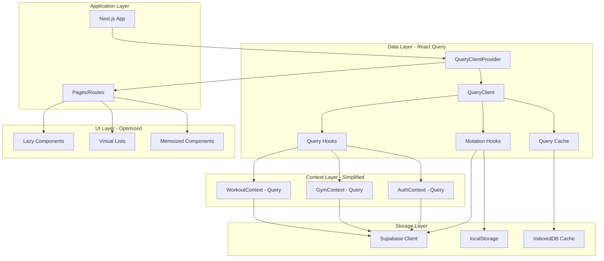
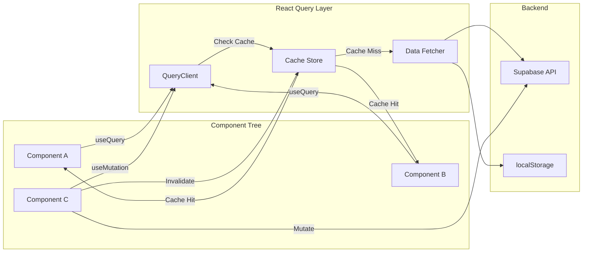
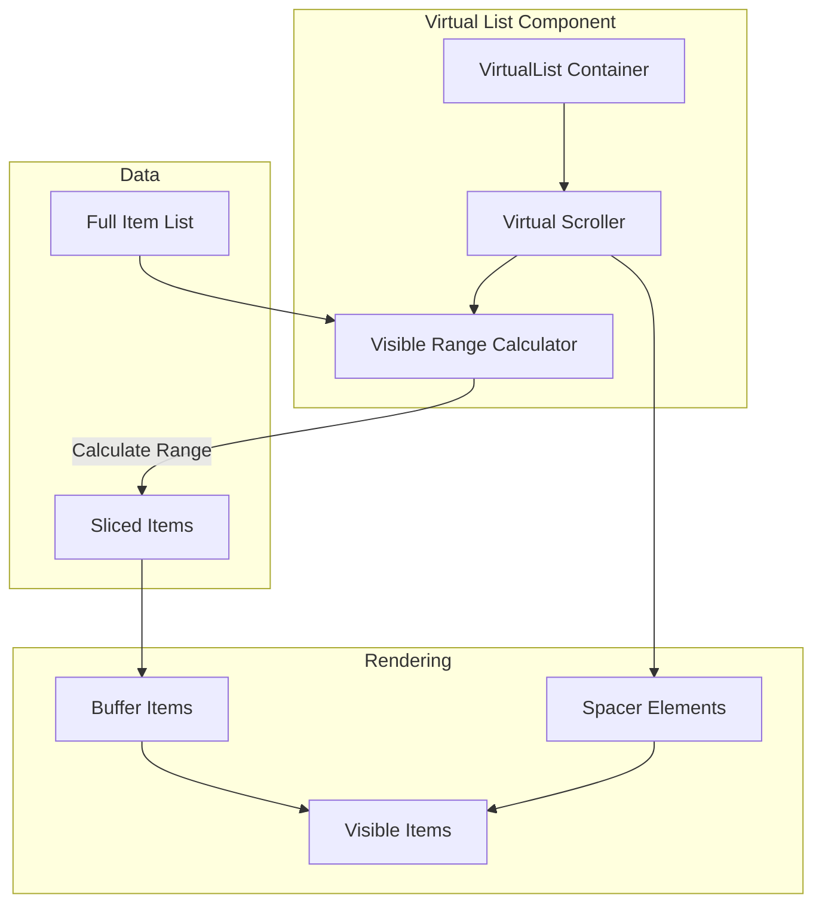
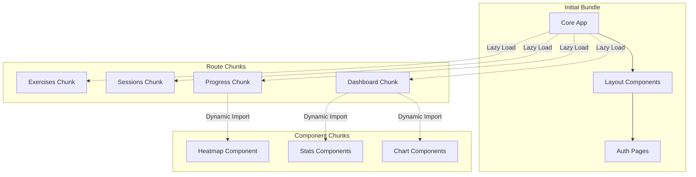

# Design Document: Performance Optimizations

## Overview

This design document outlines the comprehensive performance optimization strategy for the Gym Tracker application. The optimization focuses on four key areas:

1. **React Query Integration**: Replace manual data fetching in Context API with TanStack Query for automatic caching, revalidation, and optimized state management
2. **Virtualization**: Implement virtual scrolling for long lists (sessions, exercises) to render only visible items
3. **Code Splitting**: Lazy load heavy components and routes to reduce initial bundle size
4. **Memoization**: Prevent unnecessary re-renders using React.memo, useMemo, and useCallback

### Current Performance Challenges

The application currently faces several performance bottlenecks:

- **Manual Data Fetching**: GymContext, WorkoutContext, and AuthContext use manual useState/useEffect patterns, leading to:
  - No automatic caching (data refetched on every mount)
  - Duplicate requests when multiple components need the same data
  - Complex loading state management
  - No background refetching or stale-while-revalidate patterns

- **Large List Rendering**: Sessions and exercises pages render all items at once:
  - Sessions page can have 100+ workout sessions
  - Exercises page renders 180+ exercises
  - Each render creates DOM nodes for all items, causing performance degradation

- **Large Initial Bundle**: Dashboard and progress pages load heavy chart libraries upfront:
  - Initial bundle includes all visualization components
  - Users pay the cost even if they don't visit these pages
  - Slow initial page load and time-to-interactive

- **Unnecessary Re-renders**: Components re-render even when props haven't changed:
  - StatsCard, ExerciseSelector, and chart components re-render on parent updates
  - Expensive calculations run on every render
  - Event handlers recreated on every render, breaking memoization

### Goals

- Reduce initial bundle size by 30%+ through code splitting
- Reduce API requests by 60%+ through intelligent caching
- Maintain 60fps scrolling performance with 1000+ list items
- Reduce component re-renders by 40%+ through memoization
- Improve perceived performance with optimistic updates
- Maintain offline-first capabilities with cache persistence

## Architecture

### High-Level Architecture



### React Query Architecture



### Virtualization Architecture



### Code Splitting Strategy



## Components and Interfaces

### React Query Setup

#### QueryClient Configuration

```typescript
// lib/react-query/queryClient.ts
import { QueryClient } from '@tanstack/react-query';

export const queryClient = new QueryClient({
  defaultOptions: {
    queries: {
      // Stale time: 5 minutes for routine/session data
      staleTime: 5 * 60 * 1000,
      
      // Garbage collection time: 10 minutes
      gcTime: 10 * 60 * 1000,
      
      // Retry configuration
      retry: 3,
      retryDelay: (attemptIndex) => Math.min(1000 * 2 ** attemptIndex, 30000),
      
      // Refetch configuration
      refetchOnWindowFocus: true,
      refetchOnReconnect: true,
      refetchOnMount: true,
      
      // Network mode
      networkMode: 'offlineFirst',
    },
    mutations: {
      // Retry mutations up to 3 times
      retry: 3,
      retryDelay: (attemptIndex) => Math.min(1000 * 2 ** attemptIndex, 30000),
      
      // Network mode
      networkMode: 'offlineFirst',
    },
  },
});
```

#### Query Keys Structure

```typescript
// lib/react-query/queryKeys.ts
export const queryKeys = {
  // Routines
  routines: {
    all: ['routines'] as const,
    lists: () => [...queryKeys.routines.all, 'list'] as const,
    list: (filters: string) => [...queryKeys.routines.lists(), { filters }] as const,
    details: () => [...queryKeys.routines.all, 'detail'] as const,
    detail: (id: string) => [...queryKeys.routines.details(), id] as const,
  },
  
  // Sessions
  sessions: {
    all: ['sessions'] as const,
    lists: () => [...queryKeys.sessions.all, 'list'] as const,
    list: (filters: string) => [...queryKeys.sessions.lists(), { filters }] as const,
    details: () => [...queryKeys.sessions.all, 'detail'] as const,
    detail: (id: string) => [...queryKeys.sessions.details(), id] as const,
  },
  
  // Active Workout
  activeWorkout: {
    all: ['activeWorkout'] as const,
    detail: () => [...queryKeys.activeWorkout.all, 'detail'] as const,
  },
  
  // Profile
  profile: {
    all: ['profile'] as const,
    detail: () => [...queryKeys.profile.all, 'detail'] as const,
  },
  
  // Plans
  plans: {
    all: ['plans'] as const,
    weekly: () => [...queryKeys.plans.all, 'weekly'] as const,
    monthly: () => [...queryKeys.plans.all, 'monthly'] as const,
  },
  
  // Auth
  auth: {
    all: ['auth'] as const,
    session: () => [...queryKeys.auth.all, 'session'] as const,
    user: () => [...queryKeys.auth.all, 'user'] as const,
  },
} as const;
```

### Custom Query Hooks

#### useRoutines Hook

```typescript
// hooks/queries/useRoutines.ts
import { useQuery, useMutation, useQueryClient } from '@tanstack/react-query';
import * as storageService from '@/lib/storage/storage';
import { queryKeys } from '@/lib/react-query/queryKeys';
import type { Routine } from '@/types';

export function useRoutines() {
  const queryClient = useQueryClient();
  
  // Query for fetching routines
  const query = useQuery({
    queryKey: queryKeys.routines.lists(),
    queryFn: () => storageService.getRoutines(),
    staleTime: 5 * 60 * 1000, // 5 minutes
  });
  
  // Mutation for creating routine
  const createMutation = useMutation({
    mutationFn: (data: storageService.CreateRoutineData) => 
      storageService.createRoutine(data),
    onSuccess: () => {
      // Invalidate and refetch routines
      queryClient.invalidateQueries({ queryKey: queryKeys.routines.all });
    },
  });
  
  // Mutation for updating routine
  const updateMutation = useMutation({
    mutationFn: ({ id, data }: { id: string; data: storageService.CreateRoutineData }) =>
      storageService.updateRoutine(id, data),
    onMutate: async ({ id, data }) => {
      // Cancel outgoing refetches
      await queryClient.cancelQueries({ queryKey: queryKeys.routines.lists() });
      
      // Snapshot previous value
      const previousRoutines = queryClient.getQueryData(queryKeys.routines.lists());
      
      // Optimistically update
      queryClient.setQueryData(queryKeys.routines.lists(), (old: Routine[] | undefined) => {
        if (!old) return old;
        return old.map(routine => 
          routine.id === id ? { ...routine, ...data } : routine
        );
      });
      
      return { previousRoutines };
    },
    onError: (err, variables, context) => {
      // Rollback on error
      if (context?.previousRoutines) {
        queryClient.setQueryData(queryKeys.routines.lists(), context.previousRoutines);
      }
    },
    onSettled: () => {
      // Always refetch after error or success
      queryClient.invalidateQueries({ queryKey: queryKeys.routines.all });
    },
  });
  
  // Mutation for deleting routine
  const deleteMutation = useMutation({
    mutationFn: (id: string) => storageService.deleteRoutine(id),
    onSuccess: () => {
      queryClient.invalidateQueries({ queryKey: queryKeys.routines.all });
    },
  });
  
  return {
    routines: query.data ?? [],
    isLoading: query.isLoading,
    isError: query.isError,
    error: query.error,
    refetch: query.refetch,
    
    createRoutine: createMutation.mutateAsync,
    updateRoutine: (id: string, data: storageService.CreateRoutineData) =>
      updateMutation.mutateAsync({ id, data }),
    deleteRoutine: deleteMutation.mutateAsync,
    
    isCreating: createMutation.isPending,
    isUpdating: updateMutation.isPending,
    isDeleting: deleteMutation.isPending,
  };
}
```

#### useSessions Hook

```typescript
// hooks/queries/useSessions.ts
import { useQuery, useMutation, useQueryClient } from '@tanstack/react-query';
import * as storageService from '@/lib/storage/storage';
import { queryKeys } from '@/lib/react-query/queryKeys';
import type { WorkoutSession } from '@/types';

export function useSessions() {
  const queryClient = useQueryClient();
  
  const query = useQuery({
    queryKey: queryKeys.sessions.lists(),
    queryFn: () => storageService.getSessions(),
    staleTime: 5 * 60 * 1000,
  });
  
  const createMutation = useMutation({
    mutationFn: (session: Omit<WorkoutSession, 'id'>) =>
      storageService.saveSession(session as WorkoutSession),
    onSuccess: () => {
      queryClient.invalidateQueries({ queryKey: queryKeys.sessions.all });
    },
  });
  
  const updateMutation = useMutation({
    mutationFn: (session: WorkoutSession) =>
      storageService.updateSession(session),
    onMutate: async (updatedSession) => {
      await queryClient.cancelQueries({ queryKey: queryKeys.sessions.lists() });
      
      const previousSessions = queryClient.getQueryData(queryKeys.sessions.lists());
      
      queryClient.setQueryData(queryKeys.sessions.lists(), (old: WorkoutSession[] | undefined) => {
        if (!old) return old;
        return old.map(session =>
          session.id === updatedSession.id ? updatedSession : session
        );
      });
      
      return { previousSessions };
    },
    onError: (err, variables, context) => {
      if (context?.previousSessions) {
        queryClient.setQueryData(queryKeys.sessions.lists(), context.previousSessions);
      }
    },
    onSettled: () => {
      queryClient.invalidateQueries({ queryKey: queryKeys.sessions.all });
    },
  });
  
  const deleteMutation = useMutation({
    mutationFn: (sessionId: string) =>
      storageService.deleteSession(sessionId),
    onSuccess: () => {
      queryClient.invalidateQueries({ queryKey: queryKeys.sessions.all });
    },
  });
  
  return {
    sessions: query.data ?? [],
    isLoading: query.isLoading,
    isError: query.isError,
    error: query.error,
    refetch: query.refetch,
    
    addSession: createMutation.mutateAsync,
    updateSession: updateMutation.mutateAsync,
    deleteSession: deleteMutation.mutateAsync,
    
    isAdding: createMutation.isPending,
    isUpdating: updateMutation.isPending,
    isDeleting: deleteMutation.isPending,
  };
}
```

### Virtualization Components

#### VirtualList Component

```typescript
// components/VirtualList.tsx
import { useVirtualizer } from '@tanstack/react-virtual';
import { useRef } from 'react';

interface VirtualListProps<T> {
  items: T[];
  renderItem: (item: T, index: number) => React.ReactNode;
  estimateSize?: number;
  overscan?: number;
  className?: string;
}

export function VirtualList<T>({
  items,
  renderItem,
  estimateSize = 100,
  overscan = 5,
  className,
}: VirtualListProps<T>) {
  const parentRef = useRef<HTMLDivElement>(null);
  
  const virtualizer = useVirtualizer({
    count: items.length,
    getScrollElement: () => parentRef.current,
    estimateSize: () => estimateSize,
    overscan,
  });
  
  return (
    <div
      ref={parentRef}
      className={className}
      style={{
        height: '100%',
        overflow: 'auto',
      }}
    >
      <div
        style={{
          height: `${virtualizer.getTotalSize()}px`,
          width: '100%',
          position: 'relative',
        }}
      >
        {virtualizer.getVirtualItems().map((virtualItem) => (
          <div
            key={virtualItem.key}
            data-index={virtualItem.index}
            ref={virtualizer.measureElement}
            style={{
              position: 'absolute',
              top: 0,
              left: 0,
              width: '100%',
              transform: `translateY(${virtualItem.start}px)`,
            }}
          >
            {renderItem(items[virtualItem.index], virtualItem.index)}
          </div>
        ))}
      </div>
    </div>
  );
}
```

### Memoized Components

#### Memoized StatsCard

```typescript
// components/StatsCard.tsx
import { memo } from 'react';

interface StatsCardProps {
  title: string;
  value: string;
  icon: React.ReactNode;
  gradient: string;
  trend?: {
    value: number;
    isPositive: boolean;
  };
  subtitle?: string;
}

export const StatsCard = memo(function StatsCard({
  title,
  value,
  icon,
  gradient,
  trend,
  subtitle,
}: StatsCardProps) {
  return (
    <div className={`bg-gradient-to-br ${gradient} p-6 rounded-xl shadow-lg`}>
      <div className="flex items-center justify-between mb-4">
        <div className="text-white/80 text-sm font-medium">{title}</div>
        <div className="text-white">{icon}</div>
      </div>
      <div className="text-3xl font-bold text-white mb-2">{value}</div>
      {trend && (
        <div className={`text-sm ${trend.isPositive ? 'text-green-200' : 'text-red-200'}`}>
          {trend.isPositive ? '↗' : '↘'} {trend.value.toFixed(1)}%
          {subtitle && <span className="ml-1">{subtitle}</span>}
        </div>
      )}
    </div>
  );
}, (prevProps, nextProps) => {
  // Custom comparison function
  return (
    prevProps.title === nextProps.title &&
    prevProps.value === nextProps.value &&
    prevProps.gradient === nextProps.gradient &&
    prevProps.trend?.value === nextProps.trend?.value &&
    prevProps.trend?.isPositive === nextProps.trend?.isPositive &&
    prevProps.subtitle === nextProps.subtitle
  );
});
```

## Data Models

### Query State Types

```typescript
// types/query.ts
export interface QueryState<T> {
  data: T | undefined;
  isLoading: boolean;
  isError: boolean;
  error: Error | null;
  refetch: () => Promise<void>;
}

export interface MutationState {
  isPending: boolean;
  isError: boolean;
  error: Error | null;
}

export interface RoutinesQueryResult extends QueryState<Routine[]> {
  createRoutine: (data: CreateRoutineData) => Promise<Routine>;
  updateRoutine: (id: string, data: CreateRoutineData) => Promise<Routine>;
  deleteRoutine: (id: string) => Promise<void>;
  isCreating: boolean;
  isUpdating: boolean;
  isDeleting: boolean;
}

export interface SessionsQueryResult extends QueryState<WorkoutSession[]> {
  addSession: (session: Omit<WorkoutSession, 'id'>) => Promise<void>;
  updateSession: (session: WorkoutSession) => Promise<void>;
  deleteSession: (sessionId: string) => Promise<void>;
  isAdding: boolean;
  isUpdating: boolean;
  isDeleting: boolean;
}
```

### Cache Persistence Types

```typescript
// types/cache.ts
export interface CacheConfig {
  version: number;
  timestamp: number;
  queries: Record<string, CachedQuery>;
}

export interface CachedQuery {
  queryKey: unknown[];
  data: unknown;
  dataUpdatedAt: number;
  state: {
    status: 'success' | 'error' | 'pending';
    fetchStatus: 'idle' | 'fetching' | 'paused';
  };
}

export interface PersistOptions {
  maxAge?: number;
  buster?: string;
  serialize?: (data: unknown) => string;
  deserialize?: (data: string) => unknown;
}
```

## Correctness Properties


*A property is a characteristic or behavior that should hold true across all valid executions of a system—essentially, a formal statement about what the system should do. Properties serve as the bridge between human-readable specifications and machine-verifiable correctness guarantees.*

### Property 1: Query Cache Deduplication

*For any* query key, when multiple components request the same data simultaneously, only one network request should be made and all components should receive the same cached response.

**Validates: Requirements 1.10**

### Property 2: Automatic Background Refetch

*For any* cached query, when the data becomes stale (after staleTime expires), the next access should trigger a background refetch while serving the stale data immediately.

**Validates: Requirements 1.7**

### Property 3: Cache Invalidation on Mutation

*For any* successful mutation, all related query caches should be invalidated, triggering refetches for any active queries.

**Validates: Requirements 1.8**

### Property 4: Query State Transitions

*For any* query or mutation, the loading, error, and success states should transition correctly: pending → success/error, and these states should be accessible to consuming components.

**Validates: Requirements 1.9**

### Property 5: Optimistic Update Rollback

*For any* mutation with optimistic updates, if the mutation fails, the optimistic changes should be rolled back and the previous cached state should be restored.

**Validates: Requirements 1.11, 8.5**

### Property 6: Offline Cache Serving

*For any* query, when the app is offline, cached data should be served if available, and mutations should be queued for retry when connection is restored.

**Validates: Requirements 1.12**

### Property 7: Virtualized Rendering Efficiency

*For any* list with more than 20 items, the virtualization should render only the visible items plus buffer, not all items in the list.

**Validates: Requirements 2.2**

### Property 8: Virtualization Performance

*For any* virtualized list, scrolling should maintain 60fps performance even with 1000+ items.

**Validates: Requirements 2.4**

### Property 9: Dynamic Height Calculation

*For any* virtualized list with variable-sized items, item positions should be calculated correctly based on measured heights.

**Validates: Requirements 2.5**

### Property 10: Efficient Filter Updates

*For any* virtualized list, when filters are applied, only the visible range should be recalculated and re-rendered, not the entire list.

**Validates: Requirements 2.6**

### Property 11: Scroll Position Persistence

*For any* virtualized list, when navigating away and returning to the page, the scroll position should be preserved.

**Validates: Requirements 2.7**

### Property 12: Selective Item Updates

*For any* virtualized list, when a single item's data changes, only that item should re-render, not the entire list.

**Validates: Requirements 2.8**

### Property 13: Keyboard Navigation

*For any* virtualized list, arrow keys should navigate through items correctly, maintaining focus and scrolling to keep focused items visible.

**Validates: Requirements 2.9**

### Property 14: Chunk Load Retry

*For any* lazy-loaded component, if the chunk fails to load, the system should retry with exponential backoff (1s, 2s, 4s) before showing an error.

**Validates: Requirements 3.10**

### Property 15: Memoization Prevents Re-renders

*For any* memoized component, when the parent re-renders but props remain equal (by shallow comparison or custom comparator), the memoized component should not re-render.

**Validates: Requirements 4.5**

### Property 16: Mutation Retry with Backoff

*For any* failed mutation, the system should retry up to 3 times with exponential backoff delays (1s, 2s, 4s).

**Validates: Requirements 5.5**

### Property 17: Data Consistency During Migration

*For any* data entity during the migration phase, when both Context API and React Query coexist, the data returned by both systems should be consistent.

**Validates: Requirements 6.3**

### Property 18: Error Display on Query Failure

*For any* query that encounters an error, a user-friendly error message should be displayed to the user.

**Validates: Requirements 8.1**

### Property 19: Chunk Load Retry with Indicator

*For any* code chunk that fails to load, the system should retry and show a loading indicator during the retry attempts.

**Validates: Requirements 8.2**

### Property 20: Stale Data Fallback

*For any* stale cached query, when background refetch fails, the system should continue showing the stale cached data with a warning indicator.

**Validates: Requirements 8.4**

## Error Handling

### Query Error Handling

```typescript
// lib/react-query/errorHandling.ts
import { QueryClient } from '@tanstack/react-query';
import { toast } from '@/context/ToastContext';

export function setupQueryErrorHandling(queryClient: QueryClient) {
  queryClient.setDefaultOptions({
    queries: {
      onError: (error: Error) => {
        console.error('[React Query] Query error:', error);
        
        // Show user-friendly error message
        toast.error(
          error.message || 'Failed to load data. Please check your connection.'
        );
      },
      retry: (failureCount, error: any) => {
        // Don't retry on 404 or 401
        if (error?.status === 404 || error?.status === 401) {
          return false;
        }
        
        // Retry up to 3 times for other errors
        return failureCount < 3;
      },
    },
    mutations: {
      onError: (error: Error) => {
        console.error('[React Query] Mutation error:', error);
        
        // Show user-friendly error message
        toast.error(
          error.message || 'Failed to save changes. Please try again.'
        );
      },
    },
  });
}
```

### Lazy Loading Error Boundaries

```typescript
// components/LazyErrorBoundary.tsx
import { Component, ReactNode } from 'react';
import { Button } from '@/components/ui/Button';

interface Props {
  children: ReactNode;
  fallback?: ReactNode;
}

interface State {
  hasError: boolean;
  error: Error | null;
  retryCount: number;
}

export class LazyErrorBoundary extends Component<Props, State> {
  constructor(props: Props) {
    super(props);
    this.state = { hasError: false, error: null, retryCount: 0 };
  }
  
  static getDerivedStateFromError(error: Error): State {
    return { hasError: true, error, retryCount: 0 };
  }
  
  componentDidCatch(error: Error, errorInfo: any) {
    console.error('[LazyErrorBoundary] Caught error:', error, errorInfo);
    
    // Check if it's a chunk load error
    if (error.name === 'ChunkLoadError' || error.message.includes('Loading chunk')) {
      // Retry loading the chunk
      this.retryChunkLoad();
    }
  }
  
  retryChunkLoad = () => {
    const { retryCount } = this.state;
    
    if (retryCount < 3) {
      const delay = Math.min(1000 * 2 ** retryCount, 30000);
      
      setTimeout(() => {
        this.setState({ hasError: false, error: null, retryCount: retryCount + 1 });
      }, delay);
    }
  };
  
  handleReload = () => {
    window.location.reload();
  };
  
  render() {
    if (this.state.hasError) {
      if (this.props.fallback) {
        return this.props.fallback;
      }
      
      return (
        <div className="flex flex-col items-center justify-center min-h-[400px] p-8">
          <div className="text-6xl mb-4">⚠️</div>
          <h2 className="text-2xl font-bold text-gray-900 dark:text-gray-100 mb-2">
            Failed to Load Component
          </h2>
          <p className="text-gray-600 dark:text-gray-400 mb-6 text-center max-w-md">
            {this.state.error?.message || 'An error occurred while loading this component.'}
          </p>
          <div className="flex gap-4">
            <Button onClick={this.retryChunkLoad} variant="primary">
              Retry
            </Button>
            <Button onClick={this.handleReload} variant="secondary">
              Reload Page
            </Button>
          </div>
        </div>
      );
    }
    
    return this.props.children;
  }
}
```

### Virtualization Error Handling

```typescript
// components/VirtualList.tsx (error handling)
import { useVirtualizer } from '@tanstack/react-virtual';
import { useRef, useState } from 'react';

export function VirtualList<T>({
  items,
  renderItem,
  estimateSize = 100,
  overscan = 5,
  className,
}: VirtualListProps<T>) {
  const parentRef = useRef<HTMLDivElement>(null);
  const [hasError, setHasError] = useState(false);
  
  try {
    const virtualizer = useVirtualizer({
      count: items.length,
      getScrollElement: () => parentRef.current,
      estimateSize: () => estimateSize,
      overscan,
    });
    
    if (hasError) {
      // Fallback to non-virtualized rendering
      return (
        <div className={className}>
          {items.map((item, index) => (
            <div key={index}>{renderItem(item, index)}</div>
          ))}
        </div>
      );
    }
    
    return (
      <div
        ref={parentRef}
        className={className}
        style={{
          height: '100%',
          overflow: 'auto',
        }}
      >
        <div
          style={{
            height: `${virtualizer.getTotalSize()}px`,
            width: '100%',
            position: 'relative',
          }}
        >
          {virtualizer.getVirtualItems().map((virtualItem) => (
            <div
              key={virtualItem.key}
              data-index={virtualItem.index}
              ref={virtualizer.measureElement}
              style={{
                position: 'absolute',
                top: 0,
                left: 0,
                width: '100%',
                transform: `translateY(${virtualItem.start}px)`,
              }}
            >
              {renderItem(items[virtualItem.index], virtualItem.index)}
            </div>
          ))}
        </div>
      </div>
    );
  } catch (error) {
    console.error('[VirtualList] Error:', error);
    setHasError(true);
    
    // Fallback to non-virtualized rendering
    return (
      <div className={className}>
        {items.map((item, index) => (
          <div key={index}>{renderItem(item, index)}</div>
        ))}
      </div>
    );
  }
}
```

## Testing Strategy

### Dual Testing Approach

The testing strategy combines unit tests for specific scenarios and property-based tests for universal behaviors:

**Unit Tests**: Focus on specific examples, edge cases, and integration points
- React Query hook behavior with specific data
- Virtualization with specific list sizes
- Lazy loading success and failure scenarios
- Memoization with specific prop changes
- Error boundary behavior with specific errors

**Property-Based Tests**: Verify universal properties across all inputs
- Query caching works for any query key
- Virtualization works for any list size > 20
- Memoization prevents re-renders for any unchanged props
- Retry logic works for any failed request
- Cache invalidation works for any mutation

### Property-Based Testing Configuration

We'll use `@fast-check/jest` for property-based testing in TypeScript/React:

```bash
npm install --save-dev @fast-check/jest
```

Each property test will:
- Run minimum 100 iterations with randomized inputs
- Reference the design document property in a comment
- Use the tag format: `Feature: performance-optimizations, Property {number}: {property_text}`

### Test Examples

#### Unit Test: Query Hook

```typescript
// __tests__/hooks/useRoutines.test.ts
import { renderHook, waitFor } from '@testing-library/react';
import { QueryClient, QueryClientProvider } from '@tanstack/react-query';
import { useRoutines } from '@/hooks/queries/useRoutines';
import * as storageService from '@/lib/storage/storage';

jest.mock('@/lib/storage/storage');

describe('useRoutines', () => {
  let queryClient: QueryClient;
  
  beforeEach(() => {
    queryClient = new QueryClient({
      defaultOptions: {
        queries: { retry: false },
        mutations: { retry: false },
      },
    });
  });
  
  afterEach(() => {
    queryClient.clear();
  });
  
  const wrapper = ({ children }: { children: React.ReactNode }) => (
    <QueryClientProvider client={queryClient}>
      {children}
    </QueryClientProvider>
  );
  
  it('should fetch routines on mount', async () => {
    const mockRoutines = [
      { id: '1', name: 'Routine 1', exercises: [] },
      { id: '2', name: 'Routine 2', exercises: [] },
    ];
    
    (storageService.getRoutines as jest.Mock).mockResolvedValue(mockRoutines);
    
    const { result } = renderHook(() => useRoutines(), { wrapper });
    
    expect(result.current.isLoading).toBe(true);
    
    await waitFor(() => {
      expect(result.current.isLoading).toBe(false);
    });
    
    expect(result.current.routines).toEqual(mockRoutines);
  });
  
  it('should handle errors gracefully', async () => {
    const error = new Error('Failed to fetch');
    (storageService.getRoutines as jest.Mock).mockRejectedValue(error);
    
    const { result } = renderHook(() => useRoutines(), { wrapper });
    
    await waitFor(() => {
      expect(result.current.isError).toBe(true);
    });
    
    expect(result.current.error).toEqual(error);
  });
});
```

#### Property Test: Cache Deduplication

```typescript
// __tests__/properties/queryCache.property.test.ts
import { fc } from '@fast-check/jest';
import { QueryClient } from '@tanstack/react-query';
import { renderHook, waitFor } from '@testing-library/react';

/**
 * Feature: performance-optimizations, Property 1: Query Cache Deduplication
 * 
 * For any query key, when multiple components request the same data simultaneously,
 * only one network request should be made and all components should receive the
 * same cached response.
 */
describe('Property: Query Cache Deduplication', () => {
  it('should deduplicate concurrent requests for any query key', async () => {
    await fc.assert(
      fc.asyncProperty(
        fc.string(), // Random query key
        fc.array(fc.integer({ min: 1, max: 100 })), // Random data
        async (queryKey, data) => {
          let fetchCount = 0;
          const queryClient = new QueryClient();
          
          const fetchFn = async () => {
            fetchCount++;
            await new Promise(resolve => setTimeout(resolve, 100));
            return data;
          };
          
          // Simulate multiple components requesting the same data
          const promises = Array.from({ length: 5 }, () =>
            queryClient.fetchQuery({
              queryKey: [queryKey],
              queryFn: fetchFn,
            })
          );
          
          const results = await Promise.all(promises);
          
          // All results should be the same
          expect(results.every(r => r === results[0])).toBe(true);
          
          // Only one fetch should have occurred
          expect(fetchCount).toBe(1);
          
          queryClient.clear();
        }
      ),
      { numRuns: 100 }
    );
  });
});
```

#### Property Test: Virtualization Efficiency

```typescript
// __tests__/properties/virtualization.property.test.ts
import { fc } from '@fast-check/jest';
import { render } from '@testing-library/react';
import { VirtualList } from '@/components/VirtualList';

/**
 * Feature: performance-optimizations, Property 7: Virtualized Rendering Efficiency
 * 
 * For any list with more than 20 items, the virtualization should render only
 * the visible items plus buffer, not all items in the list.
 */
describe('Property: Virtualized Rendering Efficiency', () => {
  it('should render only visible items for any list > 20 items', () => {
    fc.assert(
      fc.property(
        fc.integer({ min: 21, max: 1000 }), // List size > 20
        fc.integer({ min: 50, max: 200 }), // Item height
        (itemCount, itemHeight) => {
          const items = Array.from({ length: itemCount }, (_, i) => ({
            id: i,
            content: `Item ${i}`,
          }));
          
          const { container } = render(
            <div style={{ height: '600px' }}>
              <VirtualList
                items={items}
                renderItem={(item) => <div>{item.content}</div>}
                estimateSize={itemHeight}
              />
            </div>
          );
          
          // Count rendered items
          const renderedItems = container.querySelectorAll('[data-index]');
          
          // Should render fewer items than total
          expect(renderedItems.length).toBeLessThan(itemCount);
          
          // Should render at least some items
          expect(renderedItems.length).toBeGreaterThan(0);
          
          // Visible items should be less than viewport height / item height + buffer
          const maxVisibleItems = Math.ceil(600 / itemHeight) + 10; // 10 item buffer
          expect(renderedItems.length).toBeLessThanOrEqual(maxVisibleItems);
        }
      ),
      { numRuns: 100 }
    );
  });
});
```

#### Property Test: Memoization

```typescript
// __tests__/properties/memoization.property.test.ts
import { fc } from '@fast-check/jest';
import { render } from '@testing-library/react';
import { memo, useState } from 'react';

/**
 * Feature: performance-optimizations, Property 15: Memoization Prevents Re-renders
 * 
 * For any memoized component, when the parent re-renders but props remain equal,
 * the memoized component should not re-render.
 */
describe('Property: Memoization Prevents Re-renders', () => {
  it('should prevent re-renders for any unchanged props', () => {
    fc.assert(
      fc.property(
        fc.string(), // Random prop value
        fc.integer({ min: 1, max: 10 }), // Number of parent re-renders
        (propValue, reRenderCount) => {
          let childRenderCount = 0;
          
          const Child = memo(({ value }: { value: string }) => {
            childRenderCount++;
            return <div>{value}</div>;
          });
          
          const Parent = () => {
            const [, setCount] = useState(0);
            
            // Trigger parent re-renders
            for (let i = 0; i < reRenderCount; i++) {
              setCount(i);
            }
            
            return <Child value={propValue} />;
          };
          
          render(<Parent />);
          
          // Child should render only once despite parent re-renders
          expect(childRenderCount).toBe(1);
        }
      ),
      { numRuns: 100 }
    );
  });
});
```

### Integration Tests

```typescript
// __tests__/integration/reactQuery.integration.test.ts
import { renderHook, waitFor } from '@testing-library/react';
import { QueryClient, QueryClientProvider } from '@tanstack/react-query';
import { useRoutines } from '@/hooks/queries/useRoutines';
import { useSessions } from '@/hooks/queries/useSessions';

describe('React Query Integration', () => {
  it('should invalidate sessions when routine is deleted', async () => {
    const queryClient = new QueryClient();
    const wrapper = ({ children }: { children: React.ReactNode }) => (
      <QueryClientProvider client={queryClient}>
        {children}
      </QueryClientProvider>
    );
    
    const { result: routinesResult } = renderHook(() => useRoutines(), { wrapper });
    const { result: sessionsResult } = renderHook(() => useSessions(), { wrapper });
    
    // Wait for initial data
    await waitFor(() => {
      expect(routinesResult.current.isLoading).toBe(false);
      expect(sessionsResult.current.isLoading).toBe(false);
    });
    
    const initialSessionsLength = sessionsResult.current.sessions.length;
    
    // Delete a routine
    await routinesResult.current.deleteRoutine('routine-1');
    
    // Sessions should be refetched
    await waitFor(() => {
      expect(sessionsResult.current.sessions.length).not.toBe(initialSessionsLength);
    });
  });
});
```

### Performance Tests

```typescript
// __tests__/performance/bundleSize.test.ts
import { execSync } from 'child_process';
import fs from 'fs';
import path from 'path';

describe('Bundle Size', () => {
  it('should reduce initial bundle size by at least 30%', () => {
    // Build the app
    execSync('npm run build', { stdio: 'inherit' });
    
    // Read bundle stats
    const statsPath = path.join(__dirname, '../../.next/analyze/client.json');
    const stats = JSON.parse(fs.readFileSync(statsPath, 'utf-8'));
    
    const initialBundleSize = stats.assets
      .filter((asset: any) => asset.name.includes('main'))
      .reduce((sum: number, asset: any) => sum + asset.size, 0);
    
    // Compare with baseline (stored in a file)
    const baselinePath = path.join(__dirname, '../../.baseline/bundle-size.json');
    const baseline = JSON.parse(fs.readFileSync(baselinePath, 'utf-8'));
    
    const reduction = ((baseline.size - initialBundleSize) / baseline.size) * 100;
    
    expect(reduction).toBeGreaterThanOrEqual(30);
  });
});
```

## Migration Plan

### Phase 1: Setup and Configuration (Week 1)

1. Install React Query dependencies
   ```bash
   npm install @tanstack/react-query @tanstack/react-query-devtools
   npm install @tanstack/react-virtual
   npm install --save-dev @fast-check/jest
   ```

2. Create QueryClient configuration
   - Set up `lib/react-query/queryClient.ts`
   - Configure stale time, gc time, retry logic
   - Set up error handling

3. Add QueryClientProvider to app layout
   - Wrap app in `app/layout.tsx`
   - Add React Query DevTools in development

4. Create query keys structure
   - Define `lib/react-query/queryKeys.ts`
   - Organize keys by domain (routines, sessions, etc.)

### Phase 2: GymContext Migration (Week 2)

1. Create custom query hooks
   - `hooks/queries/useRoutines.ts`
   - `hooks/queries/useSessions.ts`
   - Implement queries and mutations

2. Add feature flag for gradual rollout
   ```typescript
   const USE_REACT_QUERY = process.env.NEXT_PUBLIC_USE_REACT_QUERY === 'true';
   ```

3. Update GymContext to use React Query hooks
   - Replace useState/useEffect with useQuery
   - Replace manual mutations with useMutation
   - Maintain backward compatibility

4. Test thoroughly
   - Unit tests for hooks
   - Integration tests for cache invalidation
   - Manual testing of all CRUD operations

### Phase 3: WorkoutContext Migration (Week 3)

1. Create workout query hooks
   - `hooks/queries/useActiveWorkout.ts`
   - Implement optimistic updates for workout progress

2. Update WorkoutContext
   - Replace manual state management
   - Implement dual-write strategy (localStorage + cache)

3. Test workout flows
   - Start workout
   - Update progress
   - Finish/cancel workout
   - Resume after app restart

### Phase 4: Virtualization (Week 4)

1. Create VirtualList component
   - Implement using @tanstack/react-virtual
   - Add error handling and fallback

2. Update Sessions page
   - Replace regular list with VirtualList
   - Test with 100+ sessions

3. Update Exercises page
   - Implement virtualization for exercise list
   - Test with 180+ exercises

4. Performance testing
   - Measure scroll performance
   - Verify 60fps with 1000+ items

### Phase 5: Code Splitting (Week 5)

1. Identify heavy components
   - Dashboard charts
   - Progress visualizations
   - Heatmap components

2. Implement lazy loading
   - Create `app/dashboard/components.lazy.tsx`
   - Create `app/progress/components.lazy.tsx`
   - Add Suspense boundaries with loading states

3. Add error boundaries
   - Implement LazyErrorBoundary
   - Add retry logic for chunk load failures

4. Measure bundle size reduction
   - Run bundle analyzer
   - Verify 30%+ reduction

### Phase 6: Memoization (Week 6)

1. Identify components to memoize
   - StatsCard
   - ExerciseSelector
   - VolumeChart
   - ActivityHeatmap

2. Wrap components with React.memo
   - Add custom comparison functions where needed
   - Use useCallback for event handlers
   - Use useMemo for expensive calculations

3. Measure re-render reduction
   - Use React Profiler
   - Verify 40%+ reduction in re-renders

### Phase 7: Testing and Optimization (Week 7)

1. Complete test suite
   - Unit tests for all hooks
   - Property tests for universal behaviors
   - Integration tests for cache invalidation
   - Performance tests for metrics

2. Performance monitoring
   - Set up React Profiler
   - Track metrics (load time, TTI, re-renders)
   - Create performance dashboard

3. Documentation
   - Update README with React Query usage
   - Document migration process
   - Create troubleshooting guide

### Phase 8: Cleanup and Launch (Week 8)

1. Remove feature flags
   - Enable React Query for all users
   - Remove old Context API code

2. Final testing
   - Full regression testing
   - Performance validation
   - User acceptance testing

3. Monitor and iterate
   - Watch for errors in production
   - Collect performance metrics
   - Iterate based on feedback

## Performance Monitoring

### Metrics to Track

1. **Bundle Size**
   - Initial bundle size
   - Lazy-loaded chunk sizes
   - Total bundle size

2. **Load Performance**
   - First Contentful Paint (FCP)
   - Largest Contentful Paint (LCP)
   - Time to Interactive (TTI)

3. **Runtime Performance**
   - Component re-render count
   - Scroll frame rate
   - Memory usage

4. **Network Performance**
   - API request count
   - Cache hit rate
   - Data transfer size

### Monitoring Implementation

```typescript
// lib/performance/monitor.ts
import { useEffect } from 'react';

export function usePerformanceMonitor(componentName: string) {
  useEffect(() => {
    if (process.env.NODE_ENV === 'development') {
      const startTime = performance.now();
      
      return () => {
        const endTime = performance.now();
        const renderTime = endTime - startTime;
        
        console.log(`[Performance] ${componentName} render time: ${renderTime.toFixed(2)}ms`);
      };
    }
  });
}

export function measureBundleSize() {
  if (typeof window !== 'undefined' && 'performance' in window) {
    const resources = performance.getEntriesByType('resource');
    const jsResources = resources.filter(r => r.name.endsWith('.js'));
    
    const totalSize = jsResources.reduce((sum, r: any) => sum + (r.transferSize || 0), 0);
    
    console.log(`[Performance] Total JS bundle size: ${(totalSize / 1024).toFixed(2)} KB`);
    
    return totalSize;
  }
  
  return 0;
}

export function measureCacheHitRate(queryClient: QueryClient) {
  const cache = queryClient.getQueryCache();
  const queries = cache.getAll();
  
  const hits = queries.filter(q => q.state.dataUpdatedAt > 0 && !q.state.isFetching).length;
  const total = queries.length;
  
  const hitRate = total > 0 ? (hits / total) * 100 : 0;
  
  console.log(`[Performance] Cache hit rate: ${hitRate.toFixed(2)}%`);
  
  return hitRate;
}
```

## Rollback Plan

If critical issues are discovered during or after migration:

1. **Immediate Rollback**
   - Revert to previous Context API implementation
   - Use feature flag to disable React Query
   - Deploy hotfix within 1 hour

2. **Data Integrity**
   - Verify no data loss occurred
   - Check localStorage and Supabase consistency
   - Restore from backups if needed

3. **User Communication**
   - Notify users of temporary issues
   - Provide status updates
   - Apologize for inconvenience

4. **Post-Mortem**
   - Analyze root cause
   - Document lessons learned
   - Update migration plan
   - Re-test before next attempt

## Success Criteria

The performance optimizations will be considered successful when:

1. **Bundle Size**: Initial bundle reduced by 30%+ (measured with webpack-bundle-analyzer)
2. **API Requests**: Request count reduced by 60%+ through caching (measured with network tab)
3. **Scroll Performance**: 60fps maintained with 1000+ items (measured with Chrome DevTools)
4. **Re-renders**: Component re-renders reduced by 40%+ (measured with React Profiler)
5. **Load Time**: Time to Interactive improved by 25%+ (measured with Lighthouse)
6. **Cache Hit Rate**: 70%+ cache hit rate for queries (measured with React Query DevTools)
7. **User Experience**: No regressions in functionality or data integrity
8. **Test Coverage**: 80%+ code coverage maintained with new tests

## Conclusion

This design provides a comprehensive approach to optimizing the Gym Tracker application's performance through React Query integration, virtualization, code splitting, and memoization. The phased migration plan ensures stability while delivering measurable improvements in bundle size, API efficiency, rendering performance, and user experience.

The combination of unit tests and property-based tests ensures correctness across all scenarios, while the monitoring and rollback plans provide safety nets for production deployment. The success criteria provide clear, measurable goals to validate the effectiveness of these optimizations.
